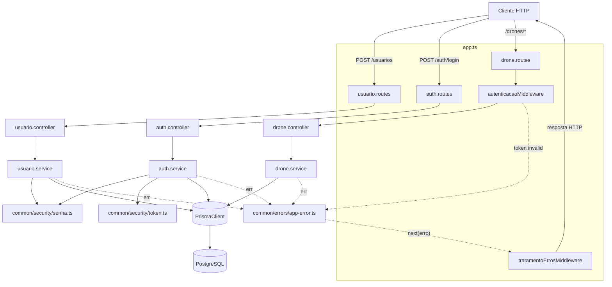

# Visão geral da arquitetura

> Retrato do estado atual do sistema — atualizado ao final de cada sprint.
> Última atualização: **Sprint 02** (CRUD completo de Drone).

## Stack

TypeScript (strict) · Express · Prisma + PostgreSQL · Zod · Jest + Supertest ·
pnpm. Arquitetura modular manual (`src/modules/<nome>/`), sem framework de
injeção de dependência, no espírito do Nest mas registrada manualmente em
`src/app.ts`. Detalhes em `.claude/rules/stack.md` e
`.claude/rules/estrutura-pastas.md`.

## Módulos existentes

| Módulo | Caminho | Responsabilidade |
|---|---|---|
| `usuario` | `src/modules/usuario/` | Cadastro de usuário (`POST /usuarios`): valida DTO, faz hash da senha, persiste, garante unicidade de `nome` (US-001). |
| `auth` | `src/modules/auth/` | Login (`POST /auth/login`): valida credenciais contra o hash persistido, emite JWT (US-002). |
| `common/middlewares` | `src/common/middlewares/` | `autenticacaoMiddleware` (US-003) — valida o JWT de requisições, anexa `req.usuarioId`; `tratamentoErrosMiddleware` — único ponto que traduz erros (`AppError`, `ZodError`, `SyntaxError` de JSON malformado — `entity.parse.failed` do `express.json()`) em resposta HTTP, último middleware registrado em `app.ts`. |
| `common/errors` | `src/common/errors/` | Hierarquia `AppError` (`ValidationError` 400, `UnauthorizedError` 401, `NotFoundError` 404, `ConflictError` 409), cada uma carregando seu próprio `statusCode`. |
| `common/security` | `src/common/security/` | `senha.ts` (hash/comparação bcrypt, ADR-001) e `token.ts` (emissão/validação de JWT, ADR-002) — funções puras reutilizadas por `usuario` e `auth`, sem acesso a `req`/`res`. |
| `config` | `src/config/` | `env.ts` (leitura validada de variáveis de ambiente), `prisma.ts` (instância única do `PrismaClient`). |
| `drone` | `src/modules/drone/` | CRUD completo de Drone, protegido por `autenticacaoMiddleware` em todas as rotas: `POST /` (US-004), `GET /` (US-005), `GET /:id` (US-006), `PATCH /:id` — edição parcial (US-007), `DELETE /:id` (US-008). Ownership por `userId` em toda operação de leitura/edição/exclusão (RN11); `PATCH` desativa Missões `ATIVA` associadas em transação (RN13); `DELETE` bloqueia se houver qualquer Missão associada, ativa ou desativada (RN15). |

**Ainda não existem** (previstos para sprints seguintes, ver
`docs/sprints/`): módulos `mapa` (Sprints 03-04), `missao` (Sprints 05-06).

## Como os módulos se comunicam

Chamadas diretas em processo (nenhuma fila, nenhum evento) — monólito Express
único:

Fluxo de uma requisição autenticada (padrão seguido por `drone` desde a
Sprint 02, e reaproveitado por `mapa`/`missao` nas sprints seguintes):
`Client → <modulo>.routes (com autenticacaoMiddleware) → <modulo>.controller
→ <modulo>.service → Prisma → PostgreSQL`, com `req.usuarioId` disponível a
partir do middleware para checagem de ownership (RN11) dentro do service de
cada módulo — em `drone`, centralizada em `droneService.buscarPorId`,
reaproveitada por `editar` e `excluir`.

## Dependências externas

- **PostgreSQL** — único armazenamento persistente, acessado exclusivamente
  via Prisma Client (nenhuma query SQL crua). Duas bases locais nesta fase:
  `backend_ic_dev` e `backend_ic_test` (usada pela suíte automatizada, limpa
  entre testes por `src/test/setup.ts`).
- **`jsonwebtoken`** — emissão/validação de token stateless (ADR-002); nenhum
  serviço externo de identidade.
- **`bcryptjs`** — hash de senha em JS puro, sem dependência nativa
  (ADR-001).
- Nenhuma dependência de fila, cache ou serviço de terceiros até esta sprint.

## Schema de dados

O schema Prisma (`prisma/schema.prisma`) já contém **todos** os models do
domínio completo (`User`, `Drone`, `Mapa`, `PontoIrrigacao`, `Missao`),
antecipados na Sprint 01 para que as regras RN13/RN15 (edição desativa
Missão; exclusão bloqueada se houver Missão associada), implementadas a
partir da Sprint 02, consultem tabelas reais desde o início — decisão
registrada nos arquivos de sprint (`docs/sprints/sprint-01.md` a
`sprint-04.md`). `User` e `Drone` têm lógica de negócio (CRUD) implementada
até aqui; `Mapa`, `PontoIrrigacao` e `Missao` seguem existindo apenas no
schema, sem service próprio ainda — usados nesta sprint só como fixtures de
teste inseridas diretamente via Prisma para validar RN13/RN15.

## O que mudou desde a última atualização

**Sprint 02** — módulo `drone` implementado por completo (US-004 a US-008):
cadastro, listagem, consulta por id, edição (`PATCH` parcial — decisão de
contrato tomada explicitamente com o usuário, já que os critérios de
aceite de US-007 não determinavam PUT completo vs. PATCH parcial) e
exclusão, todas protegidas por `autenticacaoMiddleware` e com checagem de
ownership centralizada em `droneService.buscarPorId`. RN13 (edição desativa
Missões `ATIVA` associadas, em transação) e RN15 (exclusão bloqueada por
qualquer Missão associada, ativa ou desativada) implementadas e testadas
contra a tabela `Missao` real via fixtures — sem pendência para revalidar
quando o pipeline de cálculo (US-016) existir. Nenhum ADR novo nesta sprint
(nenhuma decisão de infraestrutura/mecanismo, só de contrato de API,
registrada em `docs/implementation/US-007.md`).

Sprint 01 (anterior): projeto Express/TS/Prisma inicializado, schema
completo do domínio migrado, mecanismo de autenticação (cadastro, login,
proteção de rota) implementado e testado de ponta a ponta.
