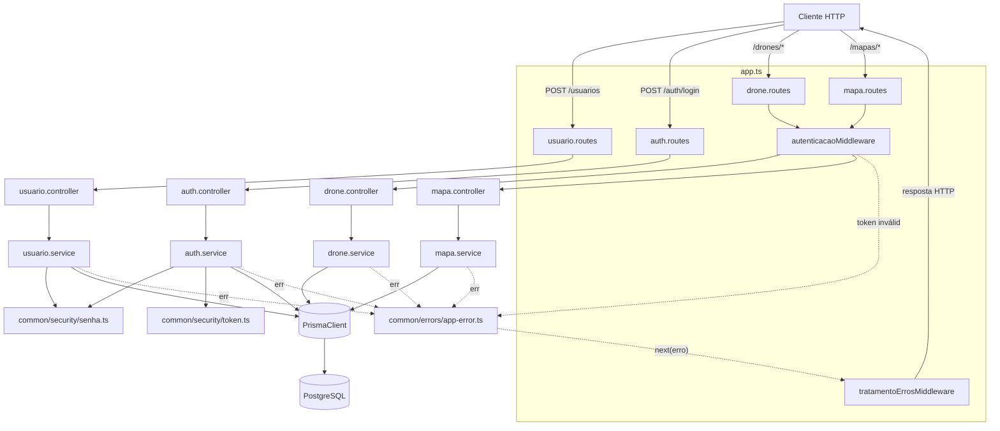

# Visão geral da arquitetura

> Retrato do estado atual do sistema — atualizado ao final de cada sprint.
> Última atualização: **Sprint 04** (Mapa: manipulação de pontos e exclusão — CRUD completo).

## Stack

TypeScript (strict) · Express · Prisma + PostgreSQL · Zod · Jest + Supertest ·
pnpm. Arquitetura modular manual (`src/modules/<nome>/`), sem framework de
injeção de dependência, no espírito do Nest mas registrada manualmente em
`src/app.ts`. Detalhes em `.claude/rules/stack.md` e
`.claude/rules/estrutura-pastas.md`.

## Módulos existentes

| Módulo | Caminho | Responsabilidade |
|---|---|---|
| `usuario` | `src/modules/usuario/` | Cadastro de usuário (`POST /usuarios`): valida DTO, faz hash da senha, persiste, garante unicidade de `nome` (US-001). |
| `auth` | `src/modules/auth/` | Login (`POST /auth/login`): valida credenciais contra o hash persistido, emite JWT (US-002). |
| `common/middlewares` | `src/common/middlewares/` | `autenticacaoMiddleware` (US-003) — valida o JWT de requisições, anexa `req.usuarioId`; `tratamentoErrosMiddleware` — único ponto que traduz erros (`AppError`, `ZodError`, `SyntaxError` de JSON malformado — `entity.parse.failed` do `express.json()`) em resposta HTTP, último middleware registrado em `app.ts`. |
| `common/errors` | `src/common/errors/` | Hierarquia `AppError` (`ValidationError` 400, `UnauthorizedError` 401, `NotFoundError` 404, `ConflictError` 409), cada uma carregando seu próprio `statusCode`. |
| `common/security` | `src/common/security/` | `senha.ts` (hash/comparação bcrypt, ADR-001) e `token.ts` (emissão/validação de JWT, ADR-002) — funções puras reutilizadas por `usuario` e `auth`, sem acesso a `req`/`res`. |
| `config` | `src/config/` | `env.ts` (leitura validada de variáveis de ambiente), `prisma.ts` (instância única do `PrismaClient`). |
| `drone` | `src/modules/drone/` | CRUD completo de Drone, protegido por `autenticacaoMiddleware` em todas as rotas: `POST /` (US-004), `GET /` (US-005), `GET /:id` (US-006), `PATCH /:id` — edição parcial (US-007), `DELETE /:id` (US-008). Ownership por `userId` em toda operação de leitura/edição/exclusão (RN11); `PATCH` desativa Missões `ATIVA` associadas em transação (RN13); `DELETE` bloqueia se houver qualquer Missão associada, ativa ou desativada (RN15). |
| `mapa` | `src/modules/mapa/` | **CRUD completo de Mapa**, protegido por `autenticacaoMiddleware`: `POST /` (US-009), `GET /` (US-010), `GET /:id` (US-011), `PATCH /:id/ponto-carregamento` (US-012), `POST /:id/pontos-irrigacao` (US-013), `DELETE /:id/pontos-irrigacao/:pontoId` (US-014), `DELETE /:id` (US-015). Ownership centralizado em `mapaService.buscarPorId`, réplica do padrão de `drone` (RN11). RN01 (não remover o último ponto de irrigação), RN16 (máx. 1000 pontos), RN17 (ponto de irrigação ≠ ponto de carregamento) e RN18 (sem pontos de irrigação duplicados) são validadas no schema Zod quando a checagem é só sobre o payload (cadastro, US-009), e no service via `ConflictError`/409 quando dependem de estado já persistido (US-012 a US-014) — decisão confirmada explicitamente com o usuário. `PATCH`/`POST`/`DELETE :pontoId` desativam Missões `ATIVA` associadas em transação (RN13); `DELETE /:id` bloqueia se houver qualquer Missão associada, ativa ou desativada (RN15), mesmo padrão de `drone`. Resposta agrupa coordenadas como `{x,y}` em vez dos campos achatados do Prisma (`ADR-003`). |

**Ainda não existe** (previsto para sprints seguintes, ver `docs/sprints/`):
módulo `missao` (Sprints 05-06) — o CRUD de Mapa e Drone está completo e
pronto para ser consumido pelo pipeline de cálculo de rota.

## Como os módulos se comunicam

Chamadas diretas em processo (nenhuma fila, nenhum evento) — monólito Express
único:

Fluxo de uma requisição autenticada (padrão seguido por `drone` desde a
Sprint 02, reaproveitado por `mapa` nesta sprint, e por `missao` nas sprints
seguintes): `Client → <modulo>.routes (com autenticacaoMiddleware) →
<modulo>.controller → <modulo>.service → Prisma → PostgreSQL`, com
`req.usuarioId` disponível a partir do middleware para checagem de ownership
(RN11) dentro do service de cada módulo — em `drone`, centralizada em
`droneService.buscarPorId`, reaproveitada por `editar` e `excluir`; em `mapa`,
a mesma estrutura em `mapaService.buscarPorId`.

## Dependências externas

- **PostgreSQL** — único armazenamento persistente, acessado exclusivamente
  via Prisma Client (nenhuma query SQL crua). Duas bases locais nesta fase:
  `backend_ic_dev` e `backend_ic_test` (usada pela suíte automatizada, limpa
  entre testes por `src/test/setup.ts`).
- **`jsonwebtoken`** — emissão/validação de token stateless (ADR-002); nenhum
  serviço externo de identidade.
- **`bcryptjs`** — hash de senha em JS puro, sem dependência nativa
  (ADR-001).
- Nenhuma dependência de fila, cache ou serviço de terceiros até esta sprint.

## Schema de dados

O schema Prisma (`prisma/schema.prisma`) já contém **todos** os models do
domínio completo (`User`, `Drone`, `Mapa`, `PontoIrrigacao`, `Missao`),
antecipados na Sprint 01 para que as regras RN13/RN15 (edição desativa
Missão; exclusão bloqueada se houver Missão associada), implementadas a
partir da Sprint 02, consultem tabelas reais desde o início — decisão
registrada nos arquivos de sprint (`docs/sprints/sprint-01.md` a
`sprint-04.md`). `User`, `Drone` e `Mapa`/`PontoIrrigacao` têm CRUD completo
implementado; `Missao` segue existindo apenas no schema, sem service próprio
— usado até aqui só como fixture de teste inserida diretamente via Prisma
para validar RN13/RN15 dos módulos `drone` e `mapa`.

## O que mudou desde a última atualização

**Sprint 04** — CRUD de Mapa encerrado (US-012 a US-015): `PATCH
/mapas/:id/ponto-carregamento` (US-012), `POST /mapas/:id/pontos-irrigacao`
(US-013), `DELETE /mapas/:id/pontos-irrigacao/:pontoId` (US-014) e `DELETE
/mapas/:id` (US-015), como sub-recursos aninhados sob `/mapas/:id` — decisão
confirmada com o usuário para manter uma responsabilidade por rota, em vez de
um `PATCH /mapas/:id` genérico com campos mutuamente exclusivos. As três
operações de escrita desativam Missões `ATIVA` associadas em transação
(RN13), mesmo padrão de `drone`; `DELETE /mapas/:id` bloqueia por qualquer
Missão associada (RN15). RN16/RN17/RN18 — que em US-009 (Sprint 03) só
podiam ser validadas no schema Zod porque todos os pontos chegavam num único
payload — precisaram migrar para o service em US-012/US-013, pois a nova
coordenada precisa ser comparada contra pontos já persistidos no banco; a
mesma mudança de contexto trocou o tipo de erro de `400` (`ZodError`) para
`409` (`ConflictError`), decisão confirmada explicitamente com o usuário e
alinhada ao padrão já usado por RN15 em `drone.excluir`. RN01 (não remover o
último ponto de irrigação) segue a mesma lógica em US-014. Nenhum ADR novo
(nenhuma decisão de infraestrutura/mecanismo nova além de `ADR-003`, já
registrada na Sprint 03).

**Sprint 03** — módulo `mapa` implementado (cadastro e consulta: US-009 a
US-011). `POST /mapas` cria o Mapa e seus PontosIrrigacao atomicamente via
nested write do Prisma, validando no schema Zod (`cadastroMapaSchema`) tanto
as regras já previstas no backlog (RN01: lista de irrigação não vazia) quanto
três regras de negócio novas, decididas explicitamente pelo usuário durante o
planejamento desta sprint e formalizadas em `regras-de-negocio.md` (RN16:
máximo de 1000 pontos de irrigação por mapa; RN17: nenhum ponto de irrigação
pode coincidir com o ponto de carregamento; RN18: nenhum ponto de irrigação
pode coincidir com outro do mesmo mapa — cada uma com mensagem de erro
dedicada). `GET /mapas` e `GET /mapas/:id` seguem o mesmo padrão de listagem
e ownership já validado em `drone` (RN11), com `buscarPorId` pronto para
reuso pelas histórias de manipulação de pontos e exclusão da Sprint 04. Novo
`ADR-003`: resposta de toda rota de Mapa agrupa coordenadas como `{x,y}` em
vez dos campos achatados do Prisma, decisão confirmada explicitamente com o
usuário e que deve se manter consistente na Sprint 04.

**Sprint 02** — módulo `drone` implementado por completo (US-004 a US-008):
cadastro, listagem, consulta por id, edição (`PATCH` parcial — decisão de
contrato tomada explicitamente com o usuário, já que os critérios de
aceite de US-007 não determinavam PUT completo vs. PATCH parcial) e
exclusão, todas protegidas por `autenticacaoMiddleware` e com checagem de
ownership centralizada em `droneService.buscarPorId`. RN13 (edição desativa
Missões `ATIVA` associadas, em transação) e RN15 (exclusão bloqueada por
qualquer Missão associada, ativa ou desativada) implementadas e testadas
contra a tabela `Missao` real via fixtures — sem pendência para revalidar
quando o pipeline de cálculo (US-016) existir. Nenhum ADR novo nesta sprint
(nenhuma decisão de infraestrutura/mecanismo, só de contrato de API,
registrada em `docs/implementation/US-007.md`).

Sprint 01 (anterior): projeto Express/TS/Prisma inicializado, schema
completo do domínio migrado, mecanismo de autenticação (cadastro, login,
proteção de rota) implementado e testado de ponta a ponta.
